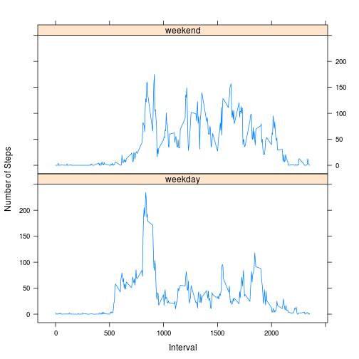

# Reproducible Research: Peer Assessment 1

Author: Stephan Fabregas  
Notes: Notes and comments taken from the assignment description in the README.md file.

## Loading and preprocessing the data
Make sure the zipped data file is in the current working directory from which you run this code.

Unzip the directory, and then load it into R

```r
unzip("activity.zip")
dt <- read.csv("activity.csv")
```

Then clean up the data - actually only need to convert the date variable to a POSIXct date variable rather than a factor (the default for the read.csv function).

```r
dt$date <- as.Date(dt$date)
```

## What is mean total number of steps taken per day?
Step 1: Make a histogram of the total number of steps taken each day.  
Start by calculating the sum of steps taken each day.

```r
counts <- tapply(dt$steps, dt$date, sum, na.rm=TRUE)
```

Then plot a histogram of the data.

```r
hist(counts)
```

 

Step 2: Calculate and report the **mean** and **median** total number of steps taken per day.

```r
mnsteps <- mean(counts, na.rm=TRUE)
mdsteps <- median(counts, na.rm=TRUE)
mnsteps
```

```
## [1] 9354
```

```r
mdsteps
```

```
## [1] 10395
```

The **mean** steps taken each day is 9354.2295 and the **median** steps taken each day is 10395.

## What is the average daily activity pattern?
Step 1: Make a time series plot (i.e. type = "l") of the 5-minute interval (x-axis) and the average number of steps taken, averaged across all days (y-axis).  

First, take the average number of steps taken for each interval across all days.

```r
avsteps <- tapply(dt$steps, dt$interval, mean, na.rm=TRUE)
```

Plot the time-series data. (The x-axis is composed of one day's worth of interval.)

```r
plot(avsteps ~ dt$interval[dt$date==dt$date[1]], type="l",
     xlab="5-min Interval", ylab="Average # Steps")
```

 

Step 2: Which 5-minute interval, on average across all days in the dataset, contains the maximun number of steps?  

Do this by finding the index of the maximum value of the average steps per interval.

```r
mxsteps <- max(avsteps)
indintmax <- match(mxsteps, avsteps)
intmax <- names(avsteps[indintmax])
```

The 104th or interval occuring at time 835 contains the maximum number of steps, on average.

## Imputing missing values
Note that there are a number of days/intervals where there are missing values (coded as `NA`). The presence of missing days may introduce bias into some calculations or summaries of the data.

Step 1: Calculate and report the total number of missing values in the dataset (i.e. the total number of rows with `NA`s)  

To find the incomplete cases, we just count the number of not complete cases.

```r
mvs <- sum(!complete.cases(dt))
nmvs <- sum(!complete.cases(dt$date, dt$interval))
```

There are 2304 missing values in the data. Since there are only 3 variables in the dataset and 0 of the missing values come from the other two variables, all 2304 missing values come from the steps variable.

Step 2: Devise a strategy for filling in all of the missing values in the dataset. The strategy does not need to be sophisticated. For example, you could use the mean/median for that day, or the mean for that 5-minute interval, etc.

We will fill in the missing values with the mean for that 5-minute interval from accross all available days.  
To get the list of replacements for the missing values, first get the indices of the missing values, then use the average steps per 5-minute invertal calculated previously.

```r
indmvs <- dt[is.na(dt$steps),]$interval
mnmvs <- avsteps[as.character(indmvs)]
```

Step 3: Create a new dataset that is equal to the original dataset but with the missing data filled in.  

Simply duplicate the dataset, then replace the missing values with the 5-minute interval mean values just calculated.

```r
mv.dt <- dt
mv.dt$steps[is.na(mv.dt$steps)] <- mnmvs
```

Step 4: Make a histogram of the total number of steps taken each day and Calculate and report the **mean** and **median** total number of steps taken per day. Do these values differ from the estimates from the first part of the assignment? What is the impact of imputing missing data on the estimates of the total daily number of steps?

Start by calculating the sum of steps taken each day, now with the missing values replaced.

```r
mv.counts <- tapply(mv.dt$steps, mv.dt$date, sum, na.rm=TRUE)
```

Then plot a histogram of the data.

```r
hist(mv.counts)
```

 


```r
mv.mnsteps <- mean(mv.counts, na.rm=TRUE)
mv.mdsteps <- median(mv.counts, na.rm=TRUE)
mv.mnsteps
```

```
## [1] 10766
```

```r
mv.mdsteps
```

```
## [1] 10766
```

The **mean** steps taken each day is 1.0766 &times; 10<sup>4</sup> and the **median** steps taken each day is 1.0766 &times; 10<sup>4</sup>, once the missing values have been replaced with the mean value for that 5-minute interval.

Days with missing values will always have steps counts that are less than or equal to the number of steps actually taken in that day. Therefore, when imputing missing data, the mean will likely increase. Further, the median will approach the mean as the outliers created by having days with missing data will come closer to the mean, especially with the method of imputing missing data selected here.

Imputing missing data in this way adjusted the days with low steps estimates caused by missing data to be considered as days with average step counts. Overall, the effect is to reduce the variance in the daily step count estimates and increase the count of days around the median count of daily steps.

## Are there differences in activity patterns between weekdays and weekends?
Step 1: Create a new factor variable in the dataset with two levels -- "weekday" and "weekend" indicating whether a given date is a weekday or weekend day.


```r
day <- factor((weekdays(dt$date)=="Saturday" | weekdays(dt$date)=="Sunday"),
              labels=c("weekday", "weekend"))
summary(day)
```

```
## weekday weekend 
##   12960    4608
```

Step 2: Make a panel plot containing a time series plot (i.e. type="l") of the 5-minute interval (x-axis) and the average number of steps taken, averaged across all weekday days or weekend days (y-axis).

Make sure the lattice library is loaded

```r
library(lattice)
```

Now calculate the averages for each 5-minute interval for both weekdays and weekend days and combine them into a single vector ready for plotting.

```r
avsteps.wkend <- tapply(dt$steps[day=="weekend"],
                        dt$interval[day=="weekend"],mean,na.rm=TRUE)
avsteps.wkday <- tapply(dt$steps[day=="weekday"],
                        dt$interval[day=="weekday"],mean,na.rm=TRUE)
avsteps.day <- as.numeric(day)
avsteps.day[avsteps.day==1] <- avsteps.wkday
avsteps.day[avsteps.day==2] <- avsteps.wkend
```

Put the data for plotting into a single data frame. The reason for this is that plotting systems like lattice and ggplot2 perform better when data are organized into a data frame. They will function without it, but unexpected behavior may result.

```r
stps <- avsteps.day
inv <- dt$interval
df <- data.frame(stps, inv, day)
```

Plot the panel data. Good idea to order the data along the grouping variable when plotting lines with lattice so that the line plot comes out looking nice.

```r
xyplot(stps ~ inv | day, data=df[order(df$inv),], type="l",
       layout=c(1,2), xlab="Interval", ylab="Number of Steps")
```

 
